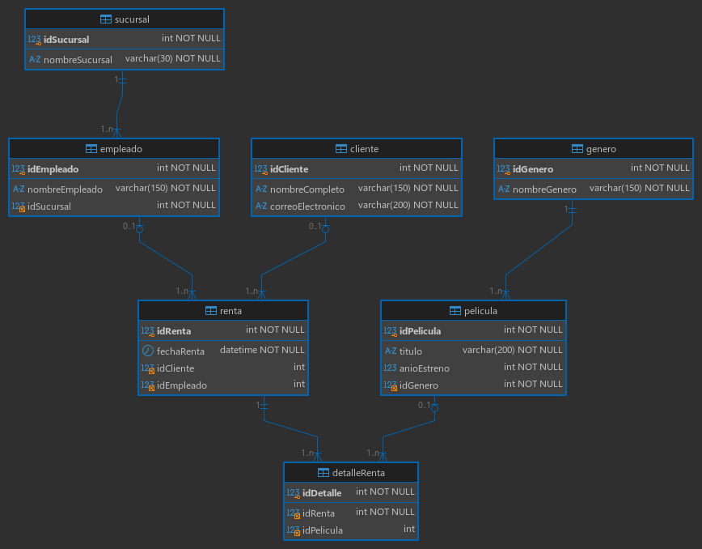

# Blockbuster Reborn

Este proyecto consiste en el diseño e implementación de una base de datos relacional orientada a la administración de un servicio de alquiler de contenido cinematográfico. El sistema gestiona los flujos operativos de establecimientos físicos y plataformas digitales, permitiendo el control centralizado de locales, personal operativo, usuarios registrados, clasificaciones por categorías y el registro detallado de las transacciones de préstamo.

---

## Componentes Tecnológicos

* **Sistema de gestión de bases de datos:** MySQL Versión 8.4.11 para entornos Linux (Servidor Comunitario)
* **Entorno de desarrollo integrado:** DBeaver 26.2.1
* **Estructuración de datos:** Lenguaje de consulta estructurado (SQL)

---

## Esquema del Modelo Relacional

La lógica del sistema organiza los datos mediante las siguientes conexiones estructurales:

### Lógica Operativa del Negocio:
* **Vinculación de sedes y personal:** Cada establecimiento coordina las actividades de múltiples miembros del equipo de trabajo.
* **Gestión de transacciones por el personal:** Los colaboradores registran las solicitudes de préstamo. Se contempla la opción de operaciones automatizadas mediante terminales autónomas donde no interviene un empleado.
* **Registro de usuarios:** Los clientes inscritos pueden realizar múltiples solicitudes de alquiler. El sistema admite transacciones rápidas sin requerir obligatoriamente el alta de un perfil de usuario.
* **Desglose de préstamos:** Una misma orden de alquiler puede agrupar distintos títulos cinematográficos mediante una entidad de asociación intermedia.
* **Clasificación de obras:** Las producciones se organizan según su género correspondiente para facilitar su localización.

---

## Atributos del Diseño Técnico

1. **Normas de normalización:** Incorporación estricta de claves primarias y secundarias, empleando la convención de escritura en formato de mayúsculas y minúsculas combinadas para variables y columnas.
2. **Filtros de validación:** Aplicación de reglas de comprobación de datos para restringir valores de fechas inconsistentes previos al origen de la cinematografía en el año 1888.
3. **Extracción de información analítica:** Construcción de consultas estructuradas mediante uniones internas, externas de correspondencia izquierda y derecha, así como la unificación de conjuntos para obtener reportes de desempeño operativo y auditorías de inventario.

