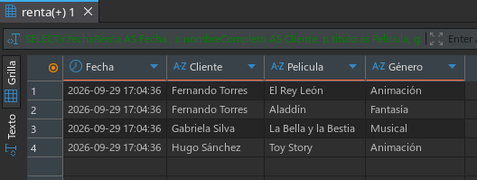
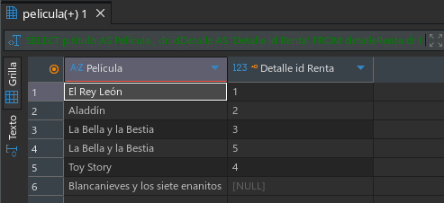
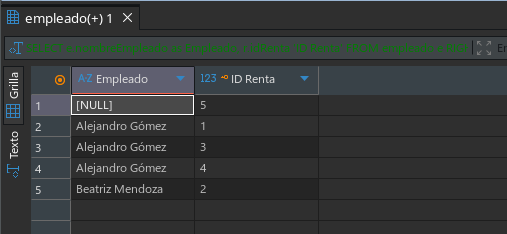

# Reporte de Resultados Analíticos

Este documento recopila las evidencias de ejecución y las salidas de datos correspondientes a las consultas de auditoría y rendimiento operativo aplicadas sobre el modelo de datos.

---

## Reporte 1: Detalle Completo de Transacciones (Rentas Perfectas)

Esta consulta consolida la información de las órdenes de alquiler que cuentan con un registro completo de usuario, película asignada y categoría correspondiente, omitiendo campos vacíos.

```sql
SELECT r.fechaRenta, c.nombreCompleto, p.titulo, g.nombreGenero
FROM detalleRenta dr
INNER JOIN renta r ON dr.idRenta = r.idRenta
INNER JOIN cliente c ON r.idCliente = c.idCliente
INNER JOIN pelicula p ON dr.idPelicula = p.idPelicula
INNER JOIN genero g ON p.idGenero = g.idGenero;
```

### Evidencia de Ejecución


---

## Reporte 2: Monitoreo y Seguimiento de Usuarios

Presenta el listado total de los usuarios registrados en el sistema junto con sus identificadores de transacción. Aquellos perfiles que no registran actividad operativa muestran un valor nulo.

```sql
SELECT c.nombreCompleto, r.idRenta
FROM cliente c
LEFT JOIN renta r ON c.idCliente = r.idCliente;
```

### Evidencia de Ejecución


---

## Reporte 3: Auditoría del Catálogo de Contenido

Muestra la totalidad de los títulos almacenados en el inventario para identificar cuáles han generado transacciones y cuáles permanecen sin actividad en los estantes (registrando valores nulos).

```sql
SELECT p.titulo, dr.idDetalle
FROM detalleRenta dr
RIGHT JOIN pelicula p ON dr.idPelicula = p.idPelicula;
```

### Evidencia de Ejecución


---

## Reporte 4: Consolidación de Rendimiento del Personal

Conciliación general entre el equipo de trabajo y las órdenes procesadas, permitiendo identificar tanto a los colaboradores sin operaciones asignadas como a los registros realizados de forma autónoma por terminales automáticas.

```sql
SELECT e.nombreEmpleado, r.idRenta
FROM empleado e
LEFT JOIN renta r ON e.idEmpleado = r.idEmpleado

UNION

SELECT e.nombreEmpleado, r.idRenta
FROM empleado e
RIGHT JOIN renta r ON e.idEmpleado = r.idEmpleado;
```

### Evidencia de Ejecución

